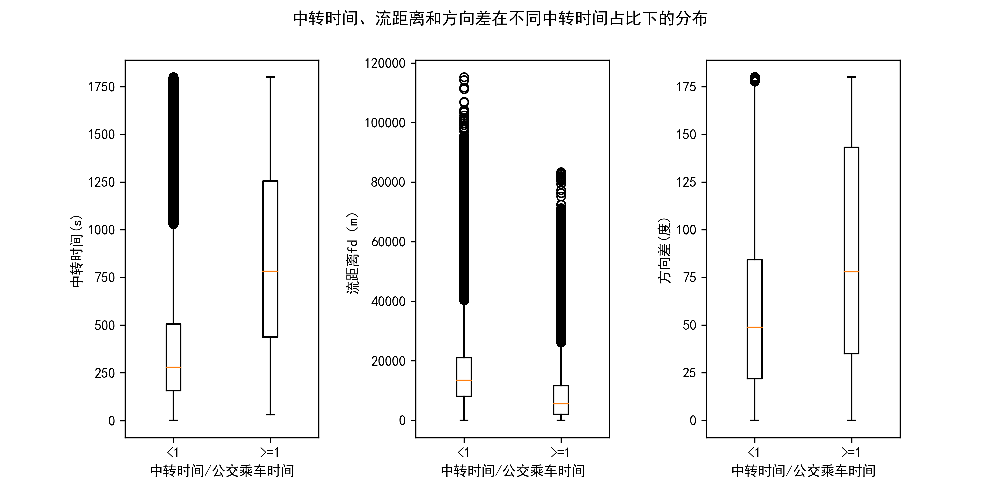

# 本文档介绍换乘规则的选定

[TOC]

## 换乘条件
1.  中转时间＜30分钟，中转距离＜300m。
2. “中转时间/公交乘车时间”<1
3. 对于前后乘车流距离在2KM内的，选取角度<150°；距离在2KM外的，无要求。

从数据量上，对2019-03-01这一天，原始数据有1118万条记录，清洗后数据有980万条，满足条件1的有89万对记录，进一步，满足条件2和3的有83万对，即满足换乘条件的记录条数有166万，占清洗后数据的17%.

## 条件解释

### 条件1：中转时间＜30分钟，中转距离＜300m。

换乘的初筛条件是中转时间＜30分钟，中转距离＜300m。具体地，设前一次乘车起终点为A1,A2，后一次乘车的起终点为B1,B2。若在A2下车与在B1上车的时间差小于30分钟，距离差小于300m，则这两次乘车满足初步的换乘条件。

但并非满足上述条件的所有乘车对均是换乘，因为可能存在30分钟内办完事情又返程的情况，所以需要把非换乘关系进一步过滤掉。

### 条件2：“中转时间/公交乘车时间”<1
**非换乘关系包括两种：（1）在中转点办事，返回起点，即往返程。 （2）在中转点办事，又前往下一个地点。** 非换乘关系的特点在于，中转站停留时间相对较长。而对于换乘，人们一般难以忍受换乘时间多于公交乘车时间的的方案。若“中转时间/公交乘车时间”>=1，再考虑到初步条件的中转时间＜30分钟，则意味着在公交乘车时间小于30分钟的情况下，换乘比乘车时间还要长。因此考虑以“中转时间/公交乘车时间”<1作为判断换乘与否的第二层标准。

对于非换乘中的往返程关系，其有两个特点：**（1）往返的上下车点相距较近。** 即除了A2与B1较近，A1与B2也应较近。为了度量两次乘车之间的距离，以流的视角，借用论文[1]中的公式 $ fd=\sqrt{d_{O}^{2}+d_{D}^{2}} $ ，其中 $d_{O}$  指 A1与B2的距离，$d_{D}$指A2与B1的距离。往返程关系中的流距离fd应较小，而换乘的fd应较大。**（2）往返的方向角度差应接近180°。**

如果比值“中转时间/公交乘车时间”<1判断为潜在换乘的条件合理，那么，在潜在换乘组，中转时间相对较小，fd相对较大，方向差平均也应相对较小。统计结果验证了猜想:

由箱线图可知，平均来讲，对于潜在换乘组[0,1)组，中转时间较短，前后乘车流距离较大，方向差较小，说明以1为阈值比较合理。

### 条件3：排除流距离在2KM内且方向差在150°以上的记录

由箱线图可知，对于比值<1的潜在换乘组，有流距离有很小甚至接近0的情况，但真实情况下，换乘的流距离应该偏大。对于流距离较小的情况，更可能是往返程，方向差的统计结果也证明了这一点。根据统计，在流距离2KM内，75%的方向差在150°以上。这里选取150°为阈值进行过滤。那149°就不该过滤吗？实际上，从180°起，随着角度的减小，往返程逐渐变成非换乘关系的第二种，即前往下一个目的地，该情况和换乘其实比较难以区分。另外从数据量上，即使差上10度，以140°进行过滤，该部分占比只变化万分之5，影响并不大。检查了几个140°附近的实例时，很难判断是换乘还是前往下一个目的地，可以认为是大数据中本来就存在的模糊性吧。

参考文献：

[1] Tao, R. and Thill, J. C. (2016) ‘Spatial Cluster Detection in Spatial Flow Data’, Geographical Analysis, 48(4), pp. 355–372. doi: 10.1111/gean.12100.